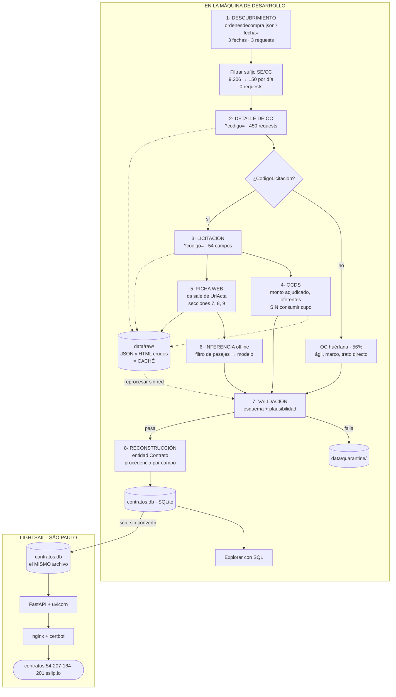

# Fase 2 — Diseño

**Autonomía A1**, con A2 solo para archivos de esquema.

Todo lo que sigue se apoya en hechos verificados contra la fuente durante la
Fase 1 y el Spike 0. Ver `docs/01-analisis.md` y `docs/00-spike.md`.

---

## 1. Flujo del programa



### Dónde ocurre cada control

| Control | Dónde | Cómo |
|---|---|---|
| **Throttling** | Pasos 1 a 5 | `REQUEST_DELAY_SECONDS`, concurrencia 1, autothrottle |
| **Reintentos** | Pasos 1 a 5 | Backoff exponencial en 429 y 5xx; el resto falla y se registra |
| **Caché** | Pasos 1 a 5 | Todo crudo se escribe a `data/raw/` antes de parsear |
| **Descarte de inválidos** | Paso 7 | A `data/quarantine/` con el motivo; **nunca aborta la corrida** |
| **Tope de gasto** | Paso 1 | `MAX_REQUESTS_PER_RUN` corta antes de quemar el cupo |

### Por qué el crudo no entra a la base

`data/raw/` guarda las respuestas tal como llegan y funciona como caché. Si el
parseo de garantías falla, se corrige y se reprocesa **desde disco, sin gastar un
request ni volver a la fuente**. Es lo que mantiene corto el bucle de
verificación: cambiar un selector y re-validar 450 contratos toma segundos.

La base solo recibe entidades ya normalizadas.

---

## 2. Modelo de datos

### Dos niveles, porque la fuente tiene dos niveles

Un hecho puede pertenecer a **la licitación** (el proceso) o a **la orden de
compra** (la ejecución). Confundirlos duplica datos y produce agregados
inflados.

- Una licitación puede originar **varias** órdenes de compra.
- El 56% de las órdenes **no tiene** licitación.

Por eso hay dos entidades y no una. `Contrato` es la unidad de la demo —una
orden de compra, un proveedor, un monto real— y `Licitacion` guarda lo que
pertenece al proceso y sería redundante replicar.

Procedencias posibles: `api_oc`, `api_licitacion`, `ocds`, `ficha_web`,
`inferencia`, `derivado`.

### Contrato — una fila por orden de compra

| Campo | Tipo | Oblig. | Procedencia | Ejemplo | Validación |
|---|---|---|---|---|---|
| `codigo_oc` | texto | sí | api_oc | `1002-183-SE25` | **clave primaria** |
| `codigo_licitacion` | texto | **no** | api_oc | `1002-9-LQ25` | nulo en el 56% |
| `tiene_proceso` | bool | sí | derivado | `true` | `codigo_licitacion is not null` |
| `tipo_oc` | enum | sí | derivado | `SE` | `SE`, `CC`, `AG`, `CM`, `TD`, `CT`; uno nuevo va a cuarentena |
| `codigo_estado` | entero | sí | api_oc | `12` | uno de los 5 conocidos |
| `estado` | texto | sí | api_oc | `Recepción Conforme` | — |
| `es_comprometido` | bool | sí | derivado | `true` | `codigo_estado != 9` |
| `es_ejecutado` | bool | sí | derivado | `true` | `codigo_estado in (6, 12)` |
| `organismo` | texto | sí | api_oc | `I. MUNICIPALIDAD DE MOSTAZAL` | no vacío |
| `organismo_rut` | texto | sí | api_oc | `69.080.500-6` | dígito verificador |
| `proveedor` | texto | sí | api_oc | `Sociedad de Transporte Jiménez Hnos.` | no vacío |
| `proveedor_rut` | texto | sí | api_oc | `76.036.979-9` | dígito verificador |
| `monto_ejecutado` | decimal | sí | api_oc | `975800` | ≥ 0 |
| `monto_adjudicado` | decimal | no | api_licitacion | `167000000` | ver atribución |
| `fecha_envio` | fecha | no | api_oc | `2025-05-02` | — |
| `fecha_aceptacion` | fecha | no | api_oc | `2025-05-02` | ≥ `fecha_envio` |
| `fecha_termino_estimada` | fecha | no | derivado | `2026-01-10` | adjudicación + duración |
| `estado_vencimiento` | enum | sí | derivado | `calculado` | ver abajo |

**Por qué `fecha_envio` y `fecha_aceptacion` viven acá y son necesarias.** El
objetivo del programa es *seguir el ciclo de vida* del contrato. Una orden
huérfana —el 56%— no tiene licitación, así que carece de `fecha_adjudicacion`,
`duracion` y `es_renovable`. **Sus propias fechas son su único anclaje
temporal.** Sin ellas, más de la mitad del dataset no tendría posición en el
tiempo y el objetivo fallaría justo donde más datos hay.

**Y por qué `fecha_termino_estimada` no se inventa para ellas.** Una compra ágil
o un trato directo es una compra puntual, no un contrato con vigencia. Se ordena
por `fecha_aceptacion` y su término queda sin calcular.

**`estado_vencimiento` dice POR QUÉ falta, en vez de dejar un nulo mudo.** Un
`NULL` mezcla tres situaciones distintas que exigen respuestas distintas:

| Valor | Significa | Caso |
|---|---|---|
| `calculado` | Hay adjudicación y duración decodificable | El 44% con proceso y unidad conocida |
| `no_declarado` | La fuente no publica duración | Las huérfanas: compra ágil, convenio marco, trato directo |
| `unidad_desconocida` | Hay duración, pero su unidad no está decodificada | `UnidadTiempoDuracionContrato` distinto de 1 y 4 |

La distinción no es cosmética. `no_declarado` es una característica de la
modalidad de compra y no hay nada que arreglar. `unidad_desconocida` es una
**deuda nuestra**: significa que apareció un valor del enum que todavía no
sabemos leer, y es una señal de que hay que investigarlo.

Es el mismo criterio que ya se aplica a las garantías, donde "no tiene
garantías" y "no pudimos leerlas" son estados distintos. Un nulo que no explica
su causa esconde el problema en vez de reportarlo.

**Consecuencia declarada:** la pregunta de negocio 1 —qué contratos vencen—
aplica al **44% con proceso**. El dashboard debe decir sobre qué universo
calcula cada indicador, para que un total no parezca cubrir todo cuando cubre
menos de la mitad.

### Licitacion — una fila por proceso, solo para el 44% que lo tiene

| Campo | Tipo | Oblig. | Procedencia | Ejemplo |
|---|---|---|---|---|
| `codigo` | texto | sí | api_licitacion | `2678-1-LR25` (**clave primaria**) |
| `nombre` | texto | sí | api_licitacion | `SERVICIO ACERCAMIENTO TRANSPORTE ESCOLAR` |
| `fecha_publicacion` | fecha | no | api_licitacion | `2025-01-24` |
| `fecha_adjudicacion` | fecha | no | api_licitacion | `2025-03-10` |
| `monto_adjudicado_total` | decimal | no | ocds | `441600000` |
| `duracion_valor` | entero | no | api_licitacion | `10` |
| `duracion_unidad` | enum | no | api_licitacion | `1`=horas, `4`=meses, otros `desconocido` |
| `es_renovable` | bool | no | api_licitacion | `false` |

**Por qué estos campos NO viven en el Contrato:** si una licitación origina cinco
órdenes, replicar su duración o su fecha de adjudicación en las cinco haría que
cualquier conteo agregado las multiplicara por cinco. Es el mismo error que se
evitó con el monto adjudicado.

**Campos eliminados tras verificar el gate:** `monto_estimado`,
`permite_subcontratacion` y `n_oferentes` no responden ninguna pregunta de
negocio ni aparecen en el objetivo, que nombra vigencia, vencimiento, renovación
y garantías. Se eliminan. Un campo "por si acaso" es deuda que nadie declara.

### Los cinco estados de una orden de compra

Medidos sobre 9.206 órdenes del 15-05-2025, con su etiqueta obtenida de la API:

| Código | Estado | Volumen | ¿Cuenta como gasto? |
|---|---|---|---|
| 12 | Recepción Conforme | 71,1% | sí |
| 6 | Aceptada | 24,3% | sí |
| 9 | **Cancelada** | 3,6% | **no** |
| 4 | Enviada a proveedor | 1,0% | sí |
| 5 | En proceso | 0,03% | sí |

**Se ingestan todas**, y el estado se guarda. Pero "gasto" son dos cosas
distintas y el modelo las separa:

| Métrica | Estados | Cobertura | Qué significa |
|---|---|---|---|
| **Comprometido** | 4, 5, 6, 12 | 96,4% | La orden existe y no fue anulada |
| **Ejecutado** | 6, 12 | **95,4%** | El proveedor aceptó o entregó |

La diferencia son las órdenes en 4 (Enviada a proveedor) y 5 (En proceso): están
comprometidas pero su destino todavía no se sabe. Un CLM distingue exactamente
eso, y **la brecha entre ambas métricas es información**, no ruido.

Las canceladas traen monto distinto de cero —se midió una de $1.346.366— así que
entrarían en cualquier suma ingenua. Ingerirlas no es ruido: cuántas órdenes
mueren en el camino le importa a un gestor de contratos.

### Atribución del monto adjudicado

Una adjudicación puede repartirse entre varios proveedores: en `2678-1-LR25` son
**cinco**, sobre $441.600.000. Como cada `Contrato` es una orden con **un**
proveedor, asignarle el total a cada uno quintuplicaría la suma.

La fuente permite atribuir exacto. Cada elemento de `Items[].Adjudicacion` trae
`RutProveedor`, `Cantidad` y `MontoUnitario`:

| RUT | Ítems | Monto |
|---|---|---|
| 76.036.979-9 | 7 | $167.000.000 |
| 11.175.478-0 | 6 | $123.100.000 |
| 10.047.811-0 | 3 | $70.500.000 |
| 11.756.584-K | 3 | $62.000.000 |
| 10.200.595-3 | 1 | $19.000.000 |
| **Total** | **20** | **$441.600.000** |

Ese total **cuadra al peso con `award.value` de OCDS**. De ahí sale una regla de
validación cruzada entre dos fuentes independientes: si no coincide, cuarentena.

**Prorratear está prohibido.** El reparto real va de $19M a $167M; por partes
iguales daría $88,3M a cada uno, un número que no existe en ninguna parte.

### El monto adjudicado NO es comparable entre contratos

Descubierto al implementar el incremento 5, y afecta la pregunta de negocio 4.

| Licitación | Adjudicado (ítems y OCDS coinciden) | Qué es en realidad |
|---|---|---|
| 2678-1-LR25 Mostazal | $441.600.000 | Valor del contrato |
| 1300-43-LP24 SENAMA | $1.900.000 | Valor del contrato |
| 2328-443-LR24 Puerto Montt | **$783,19** | **Precio por litro de diésel** |

Puerto Montt es un *convenio de suministro*: se adjudica un **precio unitario**
con cantidad abierta, y su acta declara aparte un monto estimado de
$1.500.000.000. Los $783 son reales y las dos fuentes coinciden en ellos, pero
**no son el valor del contrato**.

**Consecuencia:** sumar `monto_adjudicado` entre organismos mezcla totales con
precios unitarios. Puerto Montt aparecería con $783 en vez de $1.500 millones.

Por eso la pregunta 4 se responde con **`monto_ejecutado`**, que viene de las
órdenes de compra y es dinero que efectivamente se movió. El monto adjudicado
queda para la reconciliación entre fuentes, no para agregados.

**Regla de plausibilidad que se deriva** (incremento 6): si el monto ejecutado
de las órdenes de una licitación supera con holgura su monto adjudicado, es un
convenio de precio unitario y hay que marcarlo, no sumarlo.

### Garantia — pertenece a la licitación

| Campo | Tipo | Oblig. | Procedencia | Ejemplo |
|---|---|---|---|---|
| `licitacion_codigo` | texto | sí | derivado | `2678-1-LR25` |
| `tipo` | enum | sí | ficha_web | `seriedad_oferta`, `fiel_cumplimiento` |
| `monto_valor` | decimal | no | ficha_web | `1500000` |
| `monto_es_porcentaje` | bool | sí | ficha_web | `true` para "5 %" |
| `fecha_vencimiento` | fecha | no | ficha_web | `2026-03-02` |
| `beneficiario` | texto | no | ficha_web | `Municipalidad de Mostazal` |
| `fragmento_origen` | texto | sí | ficha_web | posición en el HTML |

**Solo la ficha web las tiene.** Ninguno de los 54 campos de la API REST las
expone, y OCDS tampoco (0 menciones). Es el caso que justifica el scraping.

### ClausulaExtraida — pertenece a la licitación

| Campo | Tipo | Oblig. | Procedencia |
|---|---|---|---|
| `licitacion_codigo` | texto | sí | derivado |
| `tipo` | enum | sí | derivado (`causales_termino`) |
| `texto` | texto | sí | inferencia |
| `fragmento_origen` | texto | **sí** | ficha_web |
| `posicion_inicio` | entero | **sí** | ficha_web |
| `modelo` | texto | sí | derivado |

**`fragmento_origen` y `posicion_inicio` son obligatorios.** Un dato inferido sin
poder mostrar de dónde salió no entra. Durante el Spike, esa trazabilidad fue lo
que permitió auditar un resultado mal interpretado.

### Discrepancia — pertenece a la licitación

Nace del hallazgo central del Spike: la ficha de SENAMA declara `36 Horas` en su
campo estructurado y **36 meses tres veces en su propia prosa**.

| Campo | Tipo | Procedencia |
|---|---|---|
| `licitacion_codigo` | texto | derivado |
| `campo` | texto | derivado |
| `valor_estructurado` | texto | api_licitacion o ficha_web |
| `valor_prosa` | texto | inferencia |
| `regla` | texto | derivado |

**Una discrepancia se registra, nunca se resuelve en silencio.** Ni el parseo ni
el modelo ganan por defecto. Detectar que la fuente se contradice es el
resultado, no un problema a ocultar.

### Los tres casos difíciles

| Caso | Frecuencia medida | Respuesta del modelo |
|---|---|---|
| Una licitación con **varias** OC | esperado | Varios `Contrato` apuntan a la misma `Licitacion`. Nada se duplica |
| Una OC **sin** licitación | **56%** | `codigo_licitacion` nulo, `tiene_proceso=false`, sin fila en `Licitacion`. Es un contrato válido |
| La ficha **se contradice** | 1 de 3 en el spike | Fila en `Discrepancia`; ambos valores se conservan |

**La clave primaria del Contrato es `codigo_oc`.** No hay un `id` separado: la
clave natural existe, es estable y dice de dónde viene el dato.

## 3. Estrategia de extracción

### Capa 1 — Esqueleto, invertido

Se parte de las **órdenes de compra**, no de las licitaciones, porque la API no
permite el recorrido inverso: rechaza `codigoLicitacion` como parámetro (HTTP
400) y el listado de OC no incluye ese campo. Indexar un día completo costaría
9.206 requests, el 92% del cupo diario.

Partiendo de la OC, además, **desaparece el problema del rezago**: si la orden ya
está publicada, su licitación existe con certeza.

### Capa 2 — Documentos, con un límite infranqueable

La ficha se obtiene con **GET limpio** usando el token `qs` que la propia API
entrega en `Adjudicacion.UrlActa`. No hay ingeniería inversa.

**Los adjuntos quedan FUERA DE ALCANCE**: `ViewAttachment.aspx` está protegida
por reCAPTCHA Enterprise. El token de redirección está en el HTML y permitiría
saltarse el chequeo; hacerlo sería evadir detección de bots. No se hace.

Se parsean solo las secciones 7, 8 y 9. Las secciones 1 a 6 son duplicado exacto
de la API o relleno legal idéntico en toda ficha.

### Capa 3 — Reconstrucción

Une las cuatro fuentes y produce `Contrato` con procedencia por campo, más las
filas de `Garantia`, `ClausulaExtraida` y `Discrepancia`.

### La muestra, elegida midiendo

Tres fechas de órdenes de compra separadas en el año, con volumen comparable:

| Fecha | Órdenes | Enlazables (SE + CC) |
|---|---|---|
| 2025-01-15 | 7.471 | 4.004 |
| 2025-05-15 | 9.206 | 4.047 |
| 2025-10-15 | 9.375 | 4.000 |

**Descartada 2025-07-16:** trae 555 órdenes contra ~9.000 de un día hábil. Es
feriado en Chile (Virgen del Carmen). Fijar fechas a ojo habría metido una
muestra basura sin que nadie lo notara.

Se piden 150 detalles por fecha: 450 contratos, ~900 requests contra un cupo de
10.000.

### Idempotencia

Clave natural: `codigo_oc`. Re-ejecutar hace *upsert*, no inserta duplicados.
`data/raw/` funciona como caché: una segunda corrida sobre la misma ventana no
emite requests nuevos.

### Reintentos

Se reintenta en `429, 500, 502, 503, 504` con backoff exponencial y tope de 3.
Todo lo demás falla de inmediato y queda registrado. Nada de `except` silencioso.

---

## 4. Decisiones de tecnología

| Decisión | Elegido | Descartado | Criterio | Se revierte si |
|---|---|---|---|---|
| Lenguaje | Python 3.11+ | — | Ecosistema de datos y scraping | — |
| Cliente HTTP | **httpx** | Scrapy, requests | Timeouts explícitos, HTTP/2, API limpia. Ver el apartado siguiente sobre Scrapy | — |
| Reintentos | **tenacity** | Middleware propio | Decorador declarativo: backoff y tope en 5 líneas legibles | — |
| Parseo HTML | **selectolax** | BeautifulSoup, lxml | Las fichas pesan ~370 KB y son 450. La velocidad se nota en el bucle de verificación | Se prefiere familiaridad sobre velocidad |
| Validación | Pydantic | Esquemas a mano | Tipado, mensajes de error claros, integración con FastAPI | — |
| **Persistencia** | **SQLite** | PostgreSQL | **450 filas de solo lectura. Un servidor sería ceremonia. Y el mismo archivo se explora con SQL en local y se despliega sin conversión** | El volumen crece o hay escrituras concurrentes |
| API | FastAPI + uvicorn | Streamlit, HTML estático | Control del render, ~100 MB, y una app real se defiende mejor | — |
| Servidor web | nginx existente | Caddy | **Ya está activo en 80/443 con certbot funcionando. Caddy sería conflicto de puertos y RAM duplicada** | — |
| Dominio | sslip.io | Comprar dominio | DNS comodín con IP embebida, sin costo, ya en uso en el servidor | Se necesita un dominio propio |
| Inferencia | Ollama local, adaptador hosted conmutable | Solo hosted | Un CLM enterprise procesa contratos confidenciales y la pregunta comercial es a dónde van. **Honestidad: estos datos son públicos, la decisión es arquitectónica** | — |
| Tests | pytest + **respx** | — | Sobre parseo y validación, con HTML y JSON guardados. `respx` simula respuestas HTTP para que **ningún test toque la red** | — |
| Calidad | ruff + mypy | — | Rápidos, un solo binario para lint y formato | — |

### Por qué NO Scrapy

Era la preferencia de partida declarada en el método. Se descarta con criterio.

Scrapy está diseñado para recorrer **miles de URLs del mismo sitio** con
scheduler, spiders, middlewares y pipelines. Este proyecto tiene **cuatro fuentes
de formas distintas** —API de órdenes de compra, API de licitaciones, OCDS y
HTML— y ~900 requests secuenciales.

Lo que aporta Scrapy y con qué se reemplaza:

| Scrapy | Reemplazo | Costo |
|---|---|---|
| Cliente HTTP | `httpx` | librería |
| `DOWNLOAD_DELAY`, autothrottle | `sleep` + contador de requests | ~15 líneas |
| `RetryMiddleware` | `tenacity` | ~5 líneas |
| `HttpCacheMiddleware` | Crudo a `data/raw/` con hash de URL | ~20 líneas |
| Selectores | `selectolax` | librería |
| Item pipelines | `validacion.py`, `reconstruccion.py` | ya están en el diseño |

Total: **~50 líneas propias** en `cliente.py`, legibles y testeables.

Y hay un costo que pesa dado el método de trabajo: **testear Scrapy es
incómodo**, exige fabricar objetos `Response`. Una función que recibe HTML y
devuelve garantías se testea con un archivo guardado y un `assert`. Con el bucle
de generación-verificación como eje del proyecto, eso decide.

**Se revierte si** el volumen crece a decenas de miles de URLs o aparece la
necesidad de concurrencia amplia sobre un mismo dominio.

### Límite de responsabilidad del modelo

Fijado con la evidencia del Spike 0:

- **Campos estructurados** (montos, fechas, RUT, códigos, garantías tabuladas):
  API o parseo determinista. **El modelo no es fuente primaria de ninguno.**
- **Prosa libre** (causales de término): el modelo, siempre con filtro de
  recuperación por delante. Sin pasajes coincidentes, el campo es `null` y **no
  se llama al modelo**.
- **Verificación cruzada**: cuando la lectura de la prosa contradice al campo
  tipado, se emite una `Discrepancia`. Nunca se corrige en silencio.

**La inferencia NUNCA va en la ruta de un request.** Medido: 7,34 GB de RAM y
entre 8 y 65 minutos por documento. Corre en lote, offline, y persiste.

---

## 5. Estructura de carpetas

```
demo_scrap/
├── CLAUDE.md
├── README.md
├── pyproject.toml
├── .env.example
├── docs/
│   ├── 00-metodo.md
│   ├── 00-spike.md
│   ├── 01-analisis.md
│   ├── 02-diseno.md
│   └── 03-plan-codificacion.md
├── src/contratos/
│   ├── config.py            # carga y valida el entorno
│   ├── cli.py               # subcomandos; cada incremento suma el suyo
│   ├── cliente.py           # HTTP con throttling, reintentos y caché
│   ├── fuentes/
│   │   ├── api_oc.py        # listado y detalle de órdenes de compra
│   │   ├── api_licitacion.py
│   │   ├── ocds.py          # monto adjudicado y oferentes
│   │   └── ficha_web.py     # secciones 7, 8 y 9
│   ├── modelos.py           # entidades Pydantic
│   ├── validacion.py        # esquema + reglas de plausibilidad
│   ├── reconstruccion.py    # arma el Contrato con procedencia
│   ├── inferencia/
│   │   ├── interfaz.py
│   │   ├── local.py         # Ollama
│   │   ├── hosted.py
│   │   └── recuperacion.py  # filtro de pasajes
│   ├── persistencia.py      # SQLite, upsert idempotente
│   └── web/
│       ├── app.py           # FastAPI
│       ├── exportar.py      # dashboard.html autocontenido (respaldo)
│       └── plantillas/
├── tests/
│   └── fixtures/            # HTML y JSON reales guardados
├── data/
│   ├── raw/                 # no versionado
│   ├── quarantine/          # no versionado
│   └── samples/             # sí versionado
└── despliegue/
    ├── nginx.conf
    └── desplegar.sh         # scp del .db + reinicio del servicio
```

---

## 6. El punto frágil

**El parseo de la sección 8 de la ficha web.**

Es la única fuente de garantías, y es HTML de una aplicación ASP.NET WebForms que
nadie se comprometió a mantener estable. No hay contrato de API detrás: si
ChileCompra rediseña la ficha, los selectores dejan de encontrar nada.

Y el modo de falla es el peligroso: **no revienta, devuelve vacío.** Una corrida
podría terminar "bien" con cero garantías extraídas y nadie notarlo.

Mitigación, en tres capas:

1. **Umbral de cobertura.** Si menos del 90% de los contratos con ficha tiene al
   menos una garantía, la corrida **falla ruidosamente**. Un cero silencioso es
   inaceptable.
2. **Tests sobre HTML guardado.** Los fixtures son fichas reales descargadas. Si
   un cambio de selector rompe el parseo, el test lo detecta sin tocar la red.
3. **Degradación explícita.** Si la ficha no se puede parsear, el contrato se
   guarda igual con `garantias = []` y una marca de que la fuente falló — no se
   confunde "sin garantías" con "no pudimos leerlas".

El segundo candidato a punto frágil sería el enum `UnidadTiempoDuracionContrato`:
solo `1` (horas) y `4` (meses) están decodificados. Cualquier otro valor se
guarda como `desconocido` y **no se intenta adivinar**.
